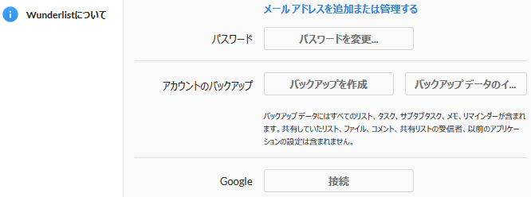
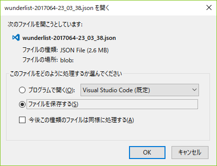
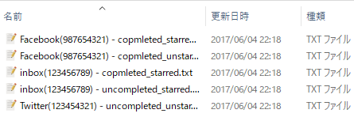
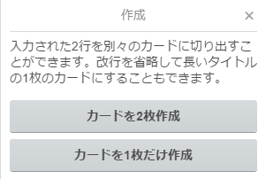
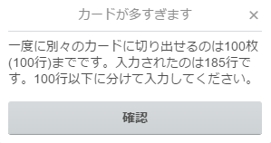

[](https://circleci.com/gh/corselia/wunder-trello/tree/master)

# Overview
- support tool for moving data from [`Wunderlist`](https://www.wunderlist.com/) to [`Trello`](https://trello.com/)
- function is limited

# Easy Trial
- clone this repository
- `$ ruby app.rb`
    - `wunderlist-test.json` used
- created `./wunder_trello/*.txt`
- `*.txt` files can import to `Trello`

# Usage

#### 1. download `JSON` file
- access to [your `Wunderlist` page](https://www.wunderlist.com/#/lists/inbox)
- select `account settings`
- click `create backup` in `account backup` section (image 1)

    

- you get `JSON` file such as `wunderlist-2017064-23_03_38.json`

    

---

#### 2. clone this repository
- clone this repository
- or download `zip` and extract it to any directory

---

#### 3. put `JSON` file
- put `1.`'s `JSON` file to `2.`'s directory
- remove sample `JSON` file, `wunderlist-test.json`

---

#### 4. exec `app.rb`
- exec `app.rb`

```ruby
$ ruby app.rb
```

---

#### 5. you get text file(s) to import to `Trello`
- in `2.`'s directory, new child directory `wunder_trello` is created
- `wunder_trello` directory has text file(s)

    

---

#### 6. import to `Trello`
- access to [`Trello`](https://trello.com/)
- add card in board you wanna import
- copy `5.`'s text file(s) content and paste it to above card
- click `add`
- you are asked about paste method as below

    

- select `create each card`
- imported from `Wunderlist` to `Trello`!

# Specifications

#### filename of text files
- example for filename of text files
    - `inbox(257277209) - copmleted_starred.txt`
    - `inbox(257277209) - uncompleted_unstarred.txt`
- filename format
    - **listname**(**list_id**) - **suffix**.txt
    - **bold parts** are based on template
- filename template is following
    - **listname** is list's name
    - **list_id** is list's id (internal value)
    - **suffix** shows completed/uncompleted and starred/unstarred of task
- because of avoiding conflict as same **listname**, **list_id** is attached to **listname**

#### others
- `"\r\n"`, `"\r"` and `"\n"` are replaced to `<br>` because they are separator of `card` on `Trello`
    - it's not cute
- `folder name` isn't considered because `JSON` file doesn't have its data
- `limit date`, `reminder`, `sub-task` and `attached file` aren't considered too, because difficult to format them for importing
- you need to divide content for paste when over 100 lines

    

#### API
- `API`? I don't know it :)

# LICENSE
- [MIT License](/LICENSE)
